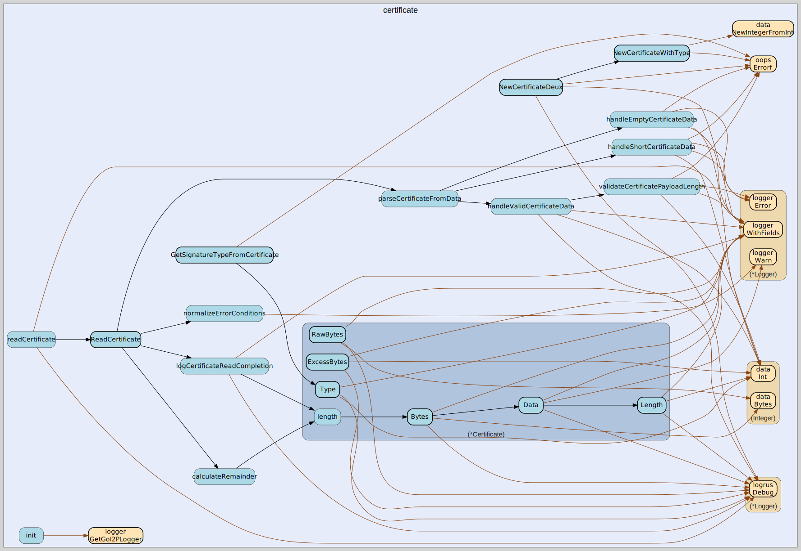

# certificate
--
    import "github.com/go-i2p/common/certificate"



Package certificate implements the certificate common-structure of I2P.

Package certificate implements the certificate common-structure of I2P.

Package certificate implements the certificate common-structure of I2P.

## Usage

```go
const (
	CERT_NULL     = iota //nolint:golint
	CERT_HASHCASH        //nolint:golint
	CERT_HIDDEN          //nolint:golint
	CERT_SIGNED          //nolint:golint
	CERT_MULTIPLE        //nolint:golint
	CERT_KEY             //nolint:golint
)
```
Certificate Types

```go
const CERT_DEFAULT_TYPE_SIZE = 1
```
CERT_DEFAULT_TYPE_SIZE is the size in bytes for the certificate type field

```go
const CERT_EMPTY_PAYLOAD_SIZE = 0
```
CERT_EMPTY_PAYLOAD_SIZE represents the size of an empty payload

```go
const CERT_KEY_SIG_TYPE_OFFSET = 0
```
CERT_KEY_SIG_TYPE_OFFSET is the byte offset where signature type begins in KEY
certificate payload

```go
const CERT_LENGTH_FIELD_END = 3
```
CERT_LENGTH_FIELD_END is the end index for the certificate length field (2 bytes
total)

```go
const CERT_LENGTH_FIELD_SIZE = 2
```
CERT_LENGTH_FIELD_SIZE is the size in bytes for the certificate length field

```go
const CERT_LENGTH_FIELD_START = 1
```
CERT_LENGTH_FIELD_START is the start index for the certificate length field

```go
const CERT_MAX_PAYLOAD_SIZE = 65535
```
CERT_MAX_PAYLOAD_SIZE is the maximum allowed size for certificate payload
according to I2P specification (2 bytes can represent up to 65535)

```go
const CERT_MAX_TYPE_VALUE = 255
```
CERT_MAX_TYPE_VALUE is the maximum valid certificate type value that fits in a
single byte (0-255 range)

```go
const CERT_MIN_KEY_PAYLOAD_SIZE = 4
```
CERT_MIN_KEY_PAYLOAD_SIZE is the minimum payload size required for KEY
certificates to contain the signature type field (2 bytes minimum)

```go
const CERT_MIN_SIZE = 3
```
CERT_MIN_SIZE is the minimum size of a valid Certificate in []byte 1 byte for
type 2 bytes for payload length

```go
const CERT_SIGNING_KEY_TYPE_SIZE = 2 //nolint:golint

```
CERT_SIGNING_KEY_TYPE_SIZE is the size in bytes of the signing key type field in
key certificates

```go
const CERT_TYPE_FIELD_END = 1
```
CERT_TYPE_FIELD_END is the end index for the certificate type field (1 byte)

#### func  GetSignatureTypeFromCertificate

```go
func GetSignatureTypeFromCertificate(cert Certificate) (int, error)
```
GetSignatureTypeFromCertificate extracts the signature type from a KEY
certificate. Returns an error if the certificate is not a KEY type or if the
payload is too short.

#### type Certificate

```go
type Certificate struct {
}
```

Certificate is the representation of an I2P Certificate.

https://geti2p.net/spec/common-structures#certificate

#### func  NewCertificate

```go
func NewCertificate() *Certificate
```
NewCertificate creates a new Certificate with default NULL type

#### func  NewCertificateDeux

```go
func NewCertificateDeux(certType int, payload []byte) (*Certificate, error)
```
NewCertificateDeux creates a new Certificate with specified type and payload.
Deprecated: Use NewCertificateWithType instead. This function will be removed in
v2.0.

#### func  NewCertificateWithType

```go
func NewCertificateWithType(certType uint8, payload []byte) (*Certificate, error)
```
NewCertificateWithType creates a new Certificate with specified type and payload

#### func  ReadCertificate

```go
func ReadCertificate(data []byte) (certificate Certificate, remainder []byte, err error)
```
ReadCertificate creates a Certificate from []byte and returns any ExcessBytes at
the end of the input. returns err if the certificate could not be read.

#### func (*Certificate) Bytes

```go
func (c *Certificate) Bytes() []byte
```
Bytes returns the entire certificate in []byte form, trims payload to specified
length.

#### func (*Certificate) Data

```go
func (c *Certificate) Data() (data []byte)
```
Data returns the payload of a Certificate, payload is trimmed to the specified
length.

#### func (*Certificate) ExcessBytes

```go
func (c *Certificate) ExcessBytes() []byte
```
ExcessBytes returns the excess bytes in a certificate found after the specified
payload length.

#### func (*Certificate) Length

```go
func (c *Certificate) Length() (length int)
```
Length returns the payload length of a Certificate.

#### func (*Certificate) RawBytes

```go
func (c *Certificate) RawBytes() []byte
```
RawBytes returns the entire certificate in []byte form, includes excess payload
data.

#### func (*Certificate) Type

```go
func (c *Certificate) Type() (certType int)
```
Type returns the Certificate type specified in the first byte of the
Certificate,


certificate 

github.com/go-i2p/common/certificate

[go-i2p template file](/template.md)
