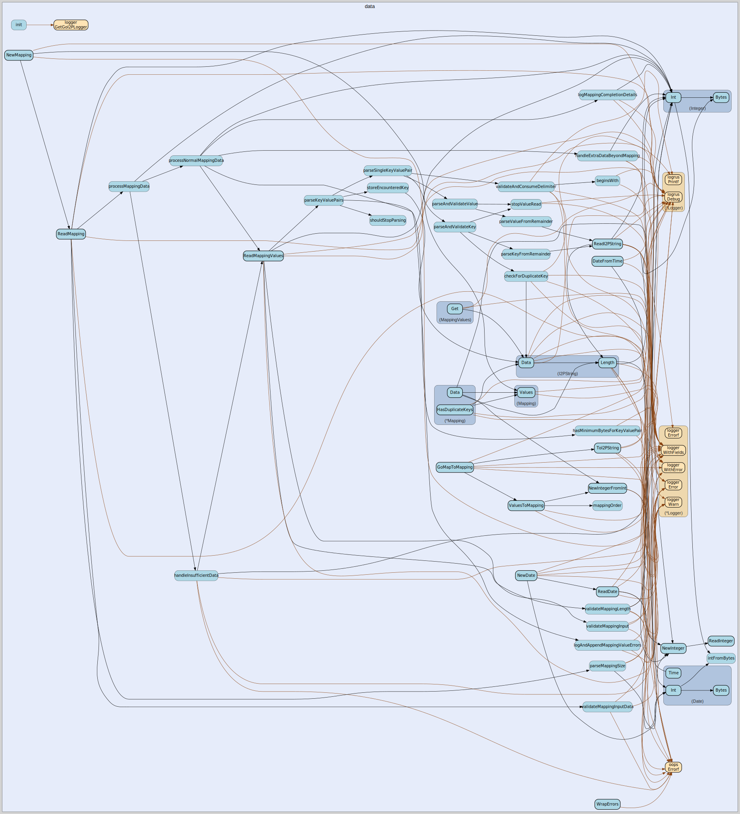

# data
--
    import "github.com/go-i2p/common/data"



Package data implements common data structures used in higher level structures.

## Usage

```go
const BITS_PER_BYTE = 8
```
BITS_PER_BYTE is the number of bits in a byte, used for bit shift calculations
Cross-Ref: integer.go

```go
const DATE_SIZE = 8
```
DATE_SIZE is the length in bytes of an I2P Date. Cross-Ref: date.go

```go
const KEY_VAL_INTEGER_LENGTH = 1
```
KEY_VAL_INTEGER_LENGTH is the length in bytes for encoding key and value lengths
in I2P mappings Cross-Ref: mapping.go

```go
const MAPPING_EQUALS_DELIMITER = 0x3d
```
MAPPING_EQUALS_DELIMITER is the ASCII character '=' (0x3d) used to separate keys
from values in I2P mappings Cross-Ref: mapping.go

```go
const MAPPING_MIN_SIZE = 3
```
MAPPING_MIN_SIZE is the minimum size in bytes for a valid I2P mapping (2-byte
length field + at least 1 byte data) Cross-Ref: mapping.go

```go
const MAPPING_SEMICOLON_DELIMITER = 0x3b
```
MAPPING_SEMICOLON_DELIMITER is the ASCII character ';' (0x3b) used to separate
key-value pairs in I2P mappings Cross-Ref: mapping.go

```go
const MAPPING_SIZE_FIELD_LENGTH = 2
```
MAPPING_SIZE_FIELD_LENGTH is the length in bytes of the mapping size field in
I2P mappings Cross-Ref: mapping.go

```go
const MAX_INTEGER_SIZE = 8
```
MAX_INTEGER_SIZE is the maximum length of an I2P integer in bytes. Cross-Ref:
integer.go

```go
const STRING_MAX_SIZE = 255
```
STRING_MAX_SIZE is the maximum number of bytes that can be stored in an I2P
string Cross-Ref: string.go

```go
var (
	ErrZeroLength            = fmt.Errorf("error parsing string: zero length")
	ErrDataTooShort          = fmt.Errorf("string parsing warning: string data is shorter than specified by length")
	ErrDataTooLong           = fmt.Errorf("string parsing warning: string contains data beyond length")
	ErrLengthMismatch        = fmt.Errorf("error reading I2P string, length does not match data")
	ErrMappingLengthMismatch = fmt.Errorf("warning parsing mapping: mapping length exceeds provided data")
)
```

#### func  PrintErrors

```go
func PrintErrors(errs []error)
```
PrintErrors prints a formatted list of errors to the console. Used in: errors.go

#### func  WrapErrors

```go
func WrapErrors(errs []error) error
```
WrapErrors compiles a slice of errors and returns them wrapped together as a
single error. Used in: errors.go

#### type Date

```go
type Date [8]byte
```

Date is the represenation of an I2P Date.

https://geti2p.net/spec/common-structures#date

#### func  DateFromTime

```go
func DateFromTime(t time.Time) (date *Date, err error)
```
DateFromTime takes a time.Time and returns a data.Date

#### func  NewDate

```go
func NewDate(data []byte) (date *Date, remainder []byte, err error)
```
NewDate creates a new Date from []byte using ReadDate. Returns a pointer to Date
unlike ReadDate.

#### func  ReadDate

```go
func ReadDate(data []byte) (date Date, remainder []byte, err error)
```
ReadDate creates a Date from []byte using the first DATE_SIZE bytes. Any data
after DATE_SIZE is returned as a remainder.

#### func (Date) Bytes

```go
func (i Date) Bytes() []byte
```
Bytes returns the raw []byte content of a Date.

#### func (Date) Int

```go
func (i Date) Int() int
```
Int returns the Date as a Go integer.

#### func (Date) Time

```go
func (date Date) Time() (date_time time.Time)
```
Time takes the value stored in date as an 8 byte big-endian integer representing
the number of milliseconds since the beginning of unix time and converts it to a
Go time.Time struct.

#### type Hash

```go
type Hash [32]byte
```

Hash is the represenation of an I2P Hash.

https://geti2p.net/spec/common-structures#hash

#### func  HashData

```go
func HashData(data []byte) (h Hash)
```
HashData returns the SHA256 sum of a []byte input as Hash.

#### func  HashReader

```go
func HashReader(r io.Reader) (h Hash, err error)
```
HashReader returns the SHA256 sum from all data read from an io.Reader. return
error if one occurs while reading from reader

#### func (Hash) Bytes

```go
func (h Hash) Bytes() [32]byte
```
Bytes returns the raw []byte content of a Hash.

#### type I2PString

```go
type I2PString []byte
```

I2PString is the representation of an I2P String.

https://geti2p.net/spec/common-structures#string

#### func  ReadI2PString

```go
func ReadI2PString(data []byte) (str I2PString, remainder []byte, err error)
```
ReadI2PString returns I2PString from a []byte. The remaining bytes after the
specified length are also returned. Returns a list of errors that occurred
during parsing.

#### func  ToI2PString

```go
func ToI2PString(data string) (str I2PString, err error)
```
ToI2PString converts a Go string to an I2PString. Returns error if the string
exceeds STRING_MAX_SIZE.

#### func (I2PString) Data

```go
func (str I2PString) Data() (data string, err error)
```
Data returns the I2PString content as a string trimmed to the specified length
and not including the length byte. Returns error encountered by Length.

#### func (I2PString) Length

```go
func (str I2PString) Length() (length int, err error)
```
Length returns the length specified in the first byte. Returns error if the
specified does not match the actual length or the string is otherwise invalid.

#### type Integer

```go
type Integer []byte
```

Integer is the represenation of an I2P Integer.

https://geti2p.net/spec/common-structures#integer

#### func  NewInteger

```go
func NewInteger(bytes []byte, size int) (integer *Integer, remainder []byte, err error)
```
NewInteger creates a new Integer from []byte using ReadInteger. Deprecated: Use
ReadInteger and take address if pointer needed. This function will be removed in
v2.0. Returns a pointer to Integer unlike ReadInteger.

#### func  NewIntegerFromInt

```go
func NewIntegerFromInt(value int, size int) (integer *Integer, err error)
```
NewIntegerFromInt creates a new Integer from a Go integer of a specified []byte
length.

#### func  ReadInteger

```go
func ReadInteger(bytes []byte, size int) (Integer, []byte)
```
ReadInteger returns an Integer from a []byte of specified length. The remaining
bytes after the specified length are also returned.

#### func (Integer) Bytes

```go
func (i Integer) Bytes() []byte
```
Bytes returns the raw []byte content of an Integer.

#### func (Integer) Int

```go
func (i Integer) Int() int
```
Int returns the Integer as a Go integer

#### type Mapping

```go
type Mapping struct {
}
```

Mapping is the represenation of an I2P Mapping.

https://geti2p.net/spec/common-structures#mapping

#### func  GoMapToMapping

```go
func GoMapToMapping(gomap map[string]string) (mapping *Mapping, err error)
```
GoMapToMapping converts a Go map of unformatted strings to *Mapping.

#### func  NewMapping

```go
func NewMapping(bytes []byte) (values *Mapping, remainder []byte, err []error)
```
NewMapping creates a new *Mapping from []byte using ReadMapping. Returns a
pointer to Mapping unlike ReadMapping.

#### func  ReadMapping

```go
func ReadMapping(bytes []byte) (mapping Mapping, remainder []byte, err []error)
```
ReadMapping returns Mapping from a []byte. The remaining bytes after the
specified length are also returned. Returns a list of errors that occurred
during parsing.

#### func  ValuesToMapping

```go
func ValuesToMapping(values MappingValues) *Mapping
```
ValuesToMapping creates a *Mapping using MappingValues. The values are sorted in
the order defined in mappingOrder.

#### func (*Mapping) Data

```go
func (mapping *Mapping) Data() []byte
```
Data returns a Mapping in its []byte form.

#### func (*Mapping) HasDuplicateKeys

```go
func (mapping *Mapping) HasDuplicateKeys() bool
```
HasDuplicateKeys returns true if two keys in a mapping are identical.

#### func (Mapping) Values

```go
func (mapping Mapping) Values() MappingValues
```
Values returns the values contained in a Mapping as MappingValues.

#### type MappingValues

```go
type MappingValues [][2]I2PString
```

MappingValues represents the parsed key value pairs inside of an I2P Mapping.

#### func  ReadMappingValues

```go
func ReadMappingValues(remainder []byte, map_length Integer) (values *MappingValues, remainder_bytes []byte, errs []error)
```
ReadMappingValues returns *MappingValues from a []byte. The remaining bytes
after the specified length are also returned. Returns a list of errors that
occurred during parsing.

#### func (MappingValues) Get

```go
func (m MappingValues) Get(key I2PString) I2PString
```
Get retrieves the value for a given key from MappingValues.


data 

github.com/go-i2p/common/data

[go-i2p template file](/template.md)
