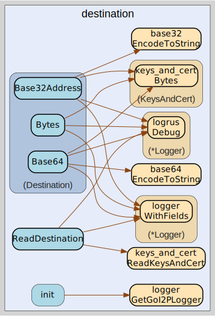

# destination
--
    import "github.com/go-i2p/common/destination"



Package destination implements the I2P Destination common data structure

## Usage

```go
const I2PBase32Suffix = ".b32.i2p"
```
I2PBase32Suffix is the standard suffix for I2P base32 addresses.
Used in destination address generation to create valid I2P hostnames.

#### type Destination

```go
type Destination struct {
	*keys_and_cert.KeysAndCert
}
```

Destination is the representation of an I2P Destination.

https://geti2p.net/spec/common-structures#destination

#### func NewDestination

```go
func NewDestination(keysAndCert *keys_and_cert.KeysAndCert) (*Destination, error)
```
NewDestination creates a new Destination from KeysAndCert. Returns an error if
the provided KeysAndCert is invalid or uses prohibited key types.

#### func NewDestinationFromBytes

```go
func NewDestinationFromBytes(data []byte) (*Destination, []byte, error)
```
NewDestinationFromBytes creates a Destination by parsing bytes. Returns the
parsed Destination, remaining bytes, and any errors encountered.

#### func ReadDestination

```go
func ReadDestination(data []byte) (Destination, []byte, error)
```
ReadDestination returns Destination from a []byte. The remaining bytes after the
specified length are also returned. Returns an error if parsing fails or if the
destination uses prohibited key types.

#### func (*Destination) Validate

```go
func (d *Destination) Validate() error
```
Validate checks if the Destination is properly initialized and uses permitted
key types. Returns an error if the destination or its components are invalid, or
if prohibited key types (MLKEM crypto, RSA/Ed25519ph signing) are present.

#### func (*Destination) IsValid

```go
func (d *Destination) IsValid() bool
```
IsValid returns true if the Destination is properly initialized. This is a
convenience method that returns false instead of an error.

#### func (*Destination) Hash

```go
func (d *Destination) Hash() ([32]byte, error)
```
Hash returns the SHA-256 hash of the Destination's binary representation.
Returns an error if the destination is not properly initialized.

#### func (*Destination) Equals

```go
func (d *Destination) Equals(other *Destination) bool
```
Equals returns true if two Destinations are byte-for-byte identical. Returns
false if either destination is nil or not properly initialized.

#### func (Destination) Bytes

```go
func (d Destination) Bytes() ([]byte, error)
```
Bytes returns the binary representation of the Destination. Returns an error if
the destination is not properly initialized.

#### func (Destination) Base32Address

```go
func (d Destination) Base32Address() (string, error)
```
Base32Address returns the I2P base32 address for this Destination. Returns an
error if the destination is not properly initialized.

#### func (Destination) Base64

```go
func (d Destination) Base64() (string, error)
```
Base64 returns the I2P base64 address for this Destination. Returns an error if
the destination is not properly initialized.

#### func (Destination) String

```go
func (d Destination) String() string
```
String returns the I2P base32 address as the default string representation.
Implements the fmt.Stringer interface.


destination

github.com/go-i2p/common/destination

[go-i2p template file](/template.md)
