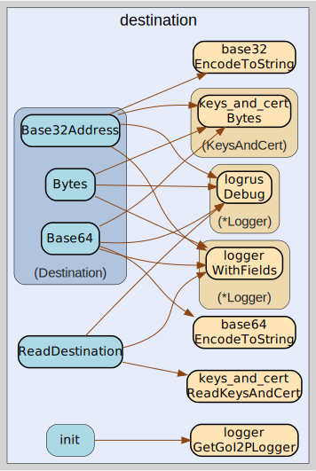

# destination
--
    import "github.com/go-i2p/common/destination"



Package destination implements the I2P Destination common data structure


Package destination implements the I2P Destination common data structure

Package destination implements the I2P Destination common data structure

Package destination implements the I2P Destination common data structure

## Usage

```go
const I2P_BASE32_SUFFIX = ".b32.i2p"
```
I2P_BASE32_SUFFIX is the standard suffix for I2P base32 addresses Used in
destination address generation to create valid I2P hostnames

#### type Destination

```go
type Destination struct {
	*keys_and_cert.KeysAndCert
}
```

Destination is the representation of an I2P Destination.

https://geti2p.net/spec/common-structures#destination

#### func  ReadDestination

```go
func ReadDestination(data []byte) (destination Destination, remainder []byte, err error)
```
ReadDestination returns Destination from a []byte. The remaining bytes after the
specified length are also returned. Returns a list of errors that occurred
during parsing.

#### func (Destination) Base32Address

```go
func (destination Destination) Base32Address() (str string)
```
Base32Address returns the I2P base32 address for this Destination.

#### func (Destination) Base64

```go
func (destination Destination) Base64() string
```
Base64 returns the I2P base64 address for this Destination.

#### func (Destination) Bytes

```go
func (destination Destination) Bytes() []byte
```
Bytes returns the binary representation of the Destination. This serializes the
destination back to []byte format for storage or transmission.


destination 

github.com/go-i2p/common/destination

[go-i2p template file](/template.md)
