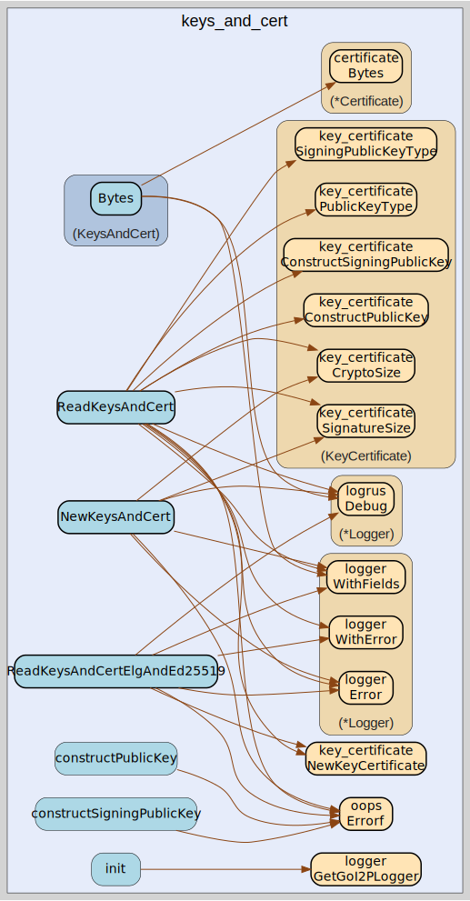

# keys_and_cert
--
    import "github.com/go-i2p/common/keys_and_cert"



Package keys_and_cert implements the I2P KeysAndCert common data structure

## Usage

```go
const (
	KEYS_AND_CERT_PUBKEY_SIZE = 256
	KEYS_AND_CERT_SPK_SIZE    = 128
	KEYS_AND_CERT_MIN_SIZE    = 387
	KEYS_AND_CERT_DATA_SIZE   = 384
)
```
Sizes of various KeysAndCert structures and requirements

#### type KeysAndCert

```go
type KeysAndCert struct {
	KeyCertificate  *key_certificate.KeyCertificate
	ReceivingPublic types.ReceivingPublicKey
	Padding         []byte
	SigningPublic   types.SigningPublicKey
}
```

KeysAndCert is the representation of an I2P KeysAndCert.

https://geti2p.net/spec/common-structures#keysandcert

#### func  NewKeysAndCert

```go
func NewKeysAndCert(
	keyCertificate *key_certificate.KeyCertificate,
	publicKey types.ReceivingPublicKey,
	padding []byte,
	signingPublicKey types.SigningPublicKey,
) (*KeysAndCert, error)
```
NewKeysAndCert creates a new KeysAndCert instance with the provided parameters.
It validates the sizes of the provided keys and padding before assembling the
struct.

#### func  ReadKeysAndCert

```go
func ReadKeysAndCert(data []byte) (*KeysAndCert, []byte, error)
```
ReadKeysAndCert creates a new *KeysAndCert from []byte using ReadKeysAndCert.
Returns a pointer to KeysAndCert unlike ReadKeysAndCert.

#### func  ReadKeysAndCertElgAndEd25519

```go
func ReadKeysAndCertElgAndEd25519(data []byte) (keysAndCert *KeysAndCert, remainder []byte, err error)
```
ReadKeysAndCertElgAndEd25519 reads KeysAndCert with fixed ElGamal and Ed25519
key sizes.

#### func (*KeysAndCert) Bytes

```go
func (kac *KeysAndCert) Bytes() ([]byte, error)
```
Bytes returns the entire KeysAndCert in []byte form as wire-format bytes.
Returns an error if the KeysAndCert is not fully initialized.

#### func (*KeysAndCert) Certificate

```go
func (keys_and_cert *KeysAndCert) Certificate() (cert certificate.Certificate)
```
Certificate returns the certificate.

#### func (*KeysAndCert) PublicKey

```go
func (kac *KeysAndCert) PublicKey() (types.ReceivingPublicKey, error)
```
PublicKey returns the public key. Returns an error if the KeysAndCert is not fully initialized.

#### func (*KeysAndCert) SigningPublicKey

```go
func (kac *KeysAndCert) SigningPublicKey() (types.SigningPublicKey, error)
```
SigningPublicKey returns the signing public key.
Returns an error if the KeysAndCert is not fully initialized.

#### type PrivateKeysAndCert

```go
type PrivateKeysAndCert struct {
	KeysAndCert
	PK_KEY  crypto.PrivateKey
	SPK_KEY crypto.PrivateKey
}
```

PrivateKeysAndCert contains a KeysAndCert along with the corresponding private
keys for the Public Key and the Signing Public Key.

#### func  NewPrivateKeysAndCert

```go
func NewPrivateKeysAndCert(
	keyCertificate *key_certificate.KeyCertificate,
	publicKey types.ReceivingPublicKey,
	padding []byte,
	signingPublicKey types.SigningPublicKey,
	encryptionPrivateKey crypto.PrivateKey,
	signingPrivateKey crypto.PrivateKey,
) (*PrivateKeysAndCert, error)
```
NewPrivateKeysAndCert creates a new PrivateKeysAndCert instance with the provided parameters.
It validates the embedded KeysAndCert and ensures both private keys are non-nil.


keys_and_cert 

github.com/go-i2p/common/keys_and_cert

[go-i2p template file](/template.md)
