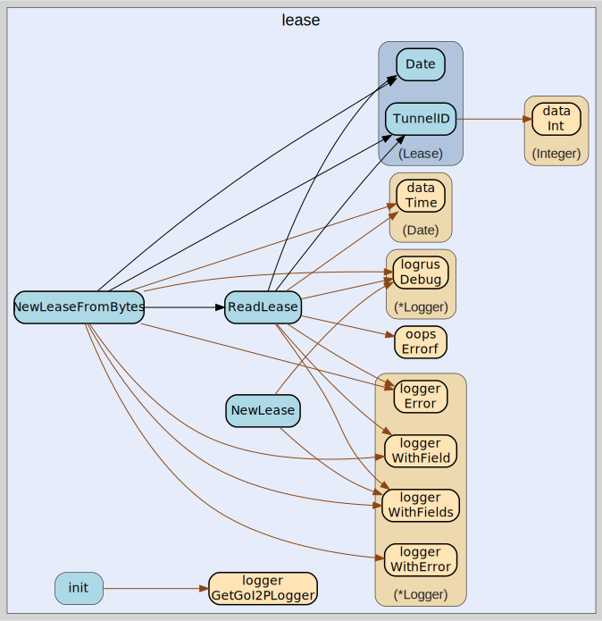

# lease
--
    import "github.com/go-i2p/common/lease"



Package lease implements the I2P lease common data structure

Package lease implements the I2P Lease common data structure according to
specification version 0.9.67.

ADDED: A Lease defines the authorization for a particular tunnel to receive
messages targeting a Destination. Each lease contains the SHA256 hash of the
RouterIdentity of the gateway router, the tunnel identifier, and an expiration
date that determines when the lease becomes invalid for message delivery.

ADDED: The lease structure is fundamental to I2P's tunnel-based message routing
system, enabling secure and anonymous communication by providing time-limited
authorization for tunnel message delivery. Leases are included in LeaseSet
structures that are distributed throughout the I2P network database.

ADDED: Key features:

    - 44-byte fixed-length structure for efficient network transmission
    - SHA256 tunnel gateway identification for secure routing
    - 32-bit tunnel ID for precise tunnel selection within gateway routers
    - Millisecond-precision expiration timestamps for fine-grained lease management
    - Complete I2P specification compliance for network interoperability

ADDED: Common usage patterns:

    lease, err := NewLease(gatewayHash, tunnelID, expirationTime)
    leaseData, remainder, err := ReadLease(networkBytes)
    gatewayHash := lease.TunnelGateway()
    tunnelID := lease.TunnelID()
    expirationDate := lease.Date()


Package lease implements the I2P lease common data structure

Package lease implements the I2P lease common data structure

## Usage

```go
const (
	// LEASE_SIZE defines the total size of a complete I2P Lease structure in bytes.
	// A Lease consists of 32 bytes for tunnel gateway hash, 4 bytes for tunnel ID, and 8 bytes for end date.
	// This constant ensures consistent memory allocation and parsing across the I2P network.
	LEASE_SIZE = 44

	// LEASE_TUNNEL_GW_SIZE defines the size of the tunnel gateway hash field in bytes.
	// This field contains the SHA256 hash of the RouterIdentity of the gateway router,
	// providing secure identification of the tunnel endpoint for message routing.
	LEASE_TUNNEL_GW_SIZE = 32

	// LEASE_TUNNEL_ID_SIZE defines the size of the tunnel identifier field in bytes.
	// The tunnel ID is a 32-bit unsigned integer that uniquely identifies a specific tunnel
	// within the context of the gateway router for message forwarding.
	LEASE_TUNNEL_ID_SIZE = 4
)
```
Sizes in bytes of various components of a Lease according to I2P specification
version 0.9.67

#### type Lease

```go
type Lease [LEASE_SIZE]byte
```

Lease is the represenation of an I2P Lease.

https://geti2p.net/spec/common-structures#lease

#### func  NewLease

```go
func NewLease(tunnelGateway data.Hash, tunnelID uint32, expirationTime time.Time) (*Lease, error)
```
NewLease creates a new Lease with the provided tunnel gateway, tunnel ID, and
expiration time. It constructs a properly formatted I2P Lease structure
according to the specification, encoding the tunnel gateway hash, tunnel ID as
big-endian uint32, and expiration time as milliseconds since epoch. Returns a
pointer to the created Lease and any error encountered during construction.
Example: lease, err := NewLease(gatewayHash, 12345,
time.Now().Add(10*time.Minute))

#### func  NewLeaseFromBytes

```go
func NewLeaseFromBytes(data []byte) (lease *Lease, remainder []byte, err error)
```
ADDED: NewLeaseFromBytes creates a new Lease pointer from raw byte data using
ReadLease. This convenience function wraps ReadLease to return a pointer to the
parsed Lease structure instead of a value copy, which is useful for APIs that
expect lease pointers. Returns nil on parsing errors along with the error and
any remaining unparsed data. Example: leasePtr, remainder, err :=
NewLeaseFromBytes(networkData)

#### func  ReadLease

```go
func ReadLease(data []byte) (lease Lease, remainder []byte, err error)
```
ADDED: ReadLease parses a Lease structure from raw byte data according to I2P
specification. Validates that the input data contains at least 44 bytes required
for a complete lease, then extracts the tunnel gateway hash, tunnel ID, and
expiration date into a Lease structure. Returns the parsed lease, any remaining
unparsed bytes, and an error if parsing fails. Example: lease, remainder, err :=
ReadLease(networkData)

#### func (Lease) Date

```go
func (lease Lease) Date() (date data.Date)
```
ADDED: Date returns the expiration date of the lease as an I2P Date structure.
Extracts the last 8 bytes of the lease structure which contain the expiration
timestamp in milliseconds since Unix epoch. This date determines when the lease
becomes invalid and can no longer be used for tunnel message delivery within the
I2P network.

#### func (Lease) TunnelGateway

```go
func (lease Lease) TunnelGateway() (hash data.Hash)
```
TunnelGateway returns the tunnel gateway hash from the lease structure. Extracts
the first 32 bytes of the lease which contain the SHA256 hash of the
RouterIdentity of the gateway router responsible for handling messages sent
through this tunnel. The returned hash can be used to identify and route
messages to the appropriate tunnel gateway.

#### func (Lease) TunnelID

```go
func (lease Lease) TunnelID() uint32
```
ADDED: TunnelID returns the tunnel identifier as a 32-bit unsigned integer.
Extracts bytes 32-35 of the lease structure and converts them from big-endian
format to a native uint32 value. This ID uniquely identifies the specific tunnel
within the context of the gateway router and is used for message routing and
delivery.


lease 

github.com/go-i2p/common/lease

[go-i2p template file](/template.md)
