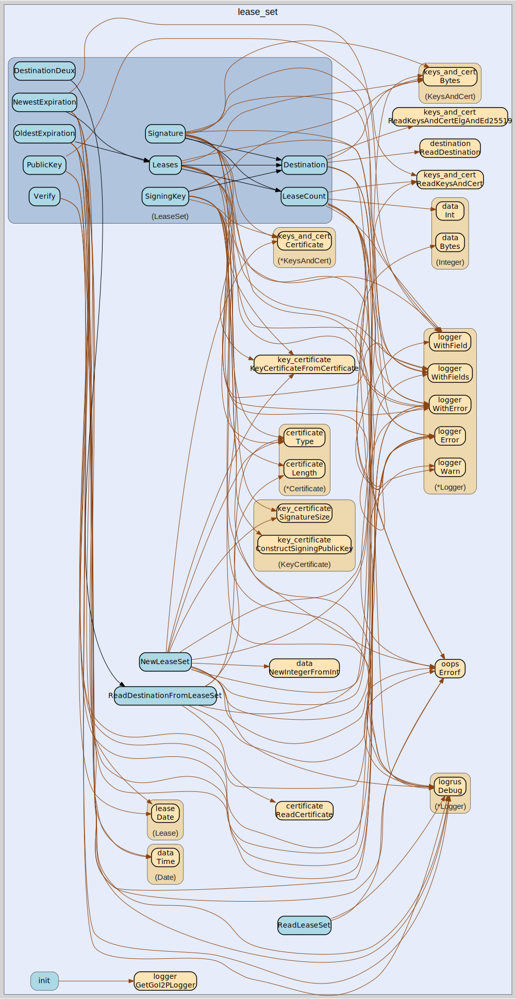

# lease_set
--
    import "github.com/go-i2p/common/lease_set"



Package lease_set implements the I2P LeaseSet (v1) common data structure.

A LeaseSet contains all currently authorized Leases for a particular Destination,
the ElGamal public key to which garlic messages can be encrypted, a signing public
key that can be used to revoke this version of the structure, and a cryptographic
signature. The LeaseSet is one of the two structures stored in the network database
(the other being RouterInfo), keyed under the SHA256 of the contained Destination.

Spec: https://geti2p.net/spec/common-structures#leaseset

## Usage

```go
const (
// LEASE_SET_PUBKEY_SIZE is the size of the ElGamal encryption public key (256 bytes).
LEASE_SET_PUBKEY_SIZE = 256

// LEASE_SET_DEFAULT_SIGNING_KEY_SIZE is the default signing public key size (128 bytes for DSA-SHA1).
LEASE_SET_DEFAULT_SIGNING_KEY_SIZE = 128

// LEASE_SET_DEFAULT_SIG_SIZE is the default signature size (40 bytes for DSA-SHA1).
LEASE_SET_DEFAULT_SIG_SIZE = 40

// LEASE_SET_MAX_LEASES is the maximum number of leases in a LeaseSet per spec.
LEASE_SET_MAX_LEASES = 16
)
```

#### func NewLeaseSet

```go
func NewLeaseSet(
dest destination.Destination,
encryptionKey types.ReceivingPublicKey,
signingKey types.SigningPublicKey,
leases []lease.Lease,
signingPrivateKey types.SigningPrivateKey,
) (*LeaseSet, error)
```
NewLeaseSet creates a new LeaseSet from the provided components. Returns a
pointer to LeaseSet for consistency with other constructors. The encryption key
must be an ElGamal public key (256 bytes); non-ElGamal types are only valid in
LeaseSet2. The signing key type must match the destination's signing key type.

#### func ReadLeaseSet

```go
func ReadLeaseSet(data []byte) (LeaseSet, error)
```
ReadLeaseSet reads a lease set from byte data. The cryptographic signature is
NOT verified during parsing; call Verify() on the returned LeaseSet to validate
the signature. Trailing data after the signature is rejected per spec.

#### func ReadDestinationFromLeaseSet

```go
func ReadDestinationFromLeaseSet(data []byte) (dest destination.Destination, remainder []byte, err error)
```
ReadDestinationFromLeaseSet reads the destination from lease set data.

#### type LeaseSet

```go
type LeaseSet struct {
// unexported fields
}
```

LeaseSet is the representation of an I2P LeaseSet.

https://geti2p.net/spec/common-structures#leaseset

#### func (LeaseSet) Bytes

```go
func (lease_set LeaseSet) Bytes() ([]byte, error)
```
Bytes returns the LeaseSet as a byte array.

#### func (LeaseSet) Destination

```go
func (lease_set LeaseSet) Destination() destination.Destination
```
Destination returns the Destination from the LeaseSet.

#### func (LeaseSet) PublicKey

```go
func (lease_set LeaseSet) PublicKey() (elgamal.ElgPublicKey, error)
```
PublicKey returns the public key as crypto.ElgPublicKey. Returns errors
encountered during parsing.

#### func (LeaseSet) SigningKey

```go
func (lease_set LeaseSet) SigningKey() (types.SigningPublicKey, error)
```
SigningKey returns the signing public key as crypto.SigningPublicKey.

#### func (LeaseSet) LeaseCount

```go
func (lease_set LeaseSet) LeaseCount() int
```
LeaseCount returns the number of leases specified by the LeaseCount value.

#### func (LeaseSet) Leases

```go
func (lease_set LeaseSet) Leases() []lease.Lease
```
Leases returns the leases as []Lease.

#### func (LeaseSet) Signature

```go
func (lease_set LeaseSet) Signature() sig.Signature
```
Signature returns the signature as Signature.

#### func (LeaseSet) Verify

```go
func (lease_set LeaseSet) Verify() error
```
Verify verifies the cryptographic signature of the LeaseSet. The signature is
computed over all serialized bytes excluding the trailing Signature, and is
verified against the signing public key from the Destination. Returns nil if the
signature is valid, or an error describing the verification failure.

#### func (LeaseSet) Validate

```go
func (ls *LeaseSet) Validate() error
```
Validate checks if the LeaseSet is properly initialized and valid. Returns an
error if the lease set is nil, has invalid field values, or has an all-zero
encryption key.

#### func (LeaseSet) IsValid

```go
func (ls *LeaseSet) IsValid() bool
```
IsValid returns true if the LeaseSet is properly initialized and valid.

#### func (LeaseSet) NewestExpiration

```go
func (lease_set LeaseSet) NewestExpiration() (newest data.Date, err error)
```
NewestExpiration returns the newest lease expiration as an I2P Date. If there are
no leases, returns epoch zero and ErrNoLeases.

#### func (LeaseSet) OldestExpiration

```go
func (lease_set LeaseSet) OldestExpiration() (earliest data.Date, err error)
```
OldestExpiration returns the oldest lease expiration as an I2P Date. If there are
no leases, returns epoch zero and ErrNoLeases.

lease_set

github.com/go-i2p/common/lease_set

[go-i2p template file](/template.md)
