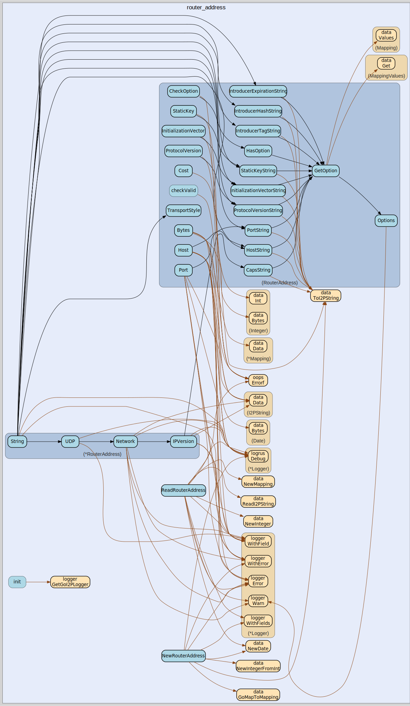

# router_address
--
    import "github.com/go-i2p/common/router_address"



Package router_address implements the I2P RouterAddress common data structure

Package router_address implements the I2P RouterAddress common data structure

Package router_address implements the I2P RouterAddress common data structure

Package router_address implements the I2P RouterAddress common data structure

Package router_address implements the I2P RouterAddress common data structure

## Usage

```go
const CAPS_OPTION_KEY = "caps"
```
CAPS_OPTION_KEY is the mapping key for the capabilities option

```go
const DEFAULT_INTRODUCER_NUMBER = 0
```
DEFAULT_INTRODUCER_NUMBER is the default introducer number when out of range

```go
const HOST_OPTION_KEY = "host"
```
HOST_OPTION_KEY is the mapping key for the host address option

```go
const INITIALIZATION_VECTOR_OPTION_KEY = "i"
```
INITIALIZATION_VECTOR_OPTION_KEY is the mapping key for the initialization
vector option

```go
const INITIALIZATION_VECTOR_SIZE = 16
```
INITIALIZATION_VECTOR_SIZE is the size in bytes of an initialization vector

```go
const INTRODUCER_EXPIRATION_PREFIX = "iexp"
```
INTRODUCER_EXPIRATION_PREFIX is the prefix for introducer expiration option keys

```go
const INTRODUCER_HASH_PREFIX = "ih"
```
INTRODUCER_HASH_PREFIX is the prefix for introducer hash option keys

```go
const INTRODUCER_TAG_PREFIX = "itag"
```
INTRODUCER_TAG_PREFIX is the prefix for introducer tag option keys

```go
const IPV4_VERSION_STRING = "4"
```
IPV4_VERSION_STRING is the string representation for IPv4 addresses

```go
const IPV6_SUFFIX = "6"
```
IPV6_SUFFIX is the suffix used to identify IPv6 addresses in capabilities

```go
const IPV6_VERSION_STRING = "6"
```
IPV6_VERSION_STRING is the string representation for IPv6 addresses

```go
const MAX_INTRODUCER_NUMBER = 2
```
MAX_INTRODUCER_NUMBER is the maximum valid introducer number

```go
const MIN_INTRODUCER_NUMBER = 0
```
MIN_INTRODUCER_NUMBER is the minimum valid introducer number

```go
const PORT_OPTION_KEY = "port"
```
PORT_OPTION_KEY is the mapping key for the port number option

```go
const PROTOCOL_VERSION_OPTION_KEY = "v"
```
PROTOCOL_VERSION_OPTION_KEY is the mapping key for the protocol version option

```go
const (
	ROUTER_ADDRESS_MIN_SIZE = 9
)
```
ROUTER_ADDRESS_MIN_SIZE defines the minimum number of bytes in a valid
RouterAddress

```go
const SSU_TRANSPORT_PREFIX = "ssu"
```
SSU_TRANSPORT_PREFIX is the prefix used to identify SSU (UDP-based) transports

```go
const STATIC_KEY_OPTION_KEY = "s"
```
STATIC_KEY_OPTION_KEY is the mapping key for the static key option

```go
const STATIC_KEY_SIZE = 32
```
STATIC_KEY_SIZE is the size in bytes of a static key used in router addresses

#### type RouterAddress

```go
type RouterAddress struct {
	TransportCost    *Integer
	ExpirationDate   *Date
	TransportType    I2PString
	TransportOptions *Mapping
}
```

RouterAddress is the represenation of an I2P RouterAddress.

https://geti2p.net/spec/common-structures#routeraddress

#### func  NewRouterAddress

```go
func NewRouterAddress(cost uint8, expiration time.Time, transportType string, options map[string]string) (*RouterAddress, error)
```
NewRouterAddress creates a new RouterAddress with the provided parameters.
Returns a pointer to RouterAddress.

#### func  ReadRouterAddress

```go
func ReadRouterAddress(data []byte) (router_address RouterAddress, remainder []byte, err error)
```
ReadRouterAddress returns RouterAddress from a []byte. The remaining bytes after
the specified length are also returned. Returns a list of errors that occurred
during parsing.

#### func (RouterAddress) Bytes

```go
func (router_address RouterAddress) Bytes() []byte
```
Bytes returns the router address as a []byte.

#### func (RouterAddress) CapsString

```go
func (router_address RouterAddress) CapsString() I2PString
```
CapsString returns the caps option as an I2PString

#### func (RouterAddress) CheckOption

```go
func (router_address RouterAddress) CheckOption(key string) bool
```
CheckOption checks if an option exists using a string key

#### func (RouterAddress) Cost

```go
func (router_address RouterAddress) Cost() int
```
Cost returns the cost for this RouterAddress as a Go integer.

#### func (RouterAddress) Expiration

```go
func (router_address RouterAddress) Expiration() Date
```
Expiration returns the expiration for this RouterAddress as an I2P Date.

#### func (RouterAddress) GetOption

```go
func (router_address RouterAddress) GetOption(key I2PString) I2PString
```
GetOption returns the value of the option specified by the key

#### func (RouterAddress) HasOption

```go
func (router_address RouterAddress) HasOption(key I2PString) bool
```
HasOption checks if a given option key exists

#### func (RouterAddress) Host

```go
func (router_address RouterAddress) Host() (net.Addr, error)
```
Host returns the host address as a net.Addr

#### func (RouterAddress) HostString

```go
func (router_address RouterAddress) HostString() I2PString
```
HostString returns the host option as an I2PString

#### func (*RouterAddress) IPVersion

```go
func (router_address *RouterAddress) IPVersion() string
```
IPVersion returns a string "4" for IPv4 or 6 for IPv6

#### func (RouterAddress) InitializationVector

```go
func (router_address RouterAddress) InitializationVector() ([16]byte, error)
```
InitializationVector returns the initialization vector as a 16-byte array

#### func (RouterAddress) InitializationVectorString

```go
func (router_address RouterAddress) InitializationVectorString() I2PString
```
InitializationVectorString returns the initialization vector option as an
I2PString

#### func (RouterAddress) IntroducerExpirationString

```go
func (router_address RouterAddress) IntroducerExpirationString(num int) I2PString
```
IntroducerExpirationString returns the introducer expiration option for the
specified number

#### func (RouterAddress) IntroducerHashString

```go
func (router_address RouterAddress) IntroducerHashString(num int) I2PString
```
IntroducerHashString returns the introducer hash option for the specified number

#### func (RouterAddress) IntroducerTagString

```go
func (router_address RouterAddress) IntroducerTagString(num int) I2PString
```
IntroducerTagString returns the introducer tag option for the specified number

#### func (*RouterAddress) Network

```go
func (router_address *RouterAddress) Network() string
```
Network implements net.Addr. It returns the transport type plus 4 or 6

#### func (RouterAddress) Options

```go
func (routerAddress RouterAddress) Options() Mapping
```
Options returns the options for this RouterAddress as an I2P Mapping.

#### func (RouterAddress) Port

```go
func (router_address RouterAddress) Port() (string, error)
```
Port returns the port number as a string

#### func (RouterAddress) PortString

```go
func (router_address RouterAddress) PortString() I2PString
```
PortString returns the port option as an I2PString

#### func (RouterAddress) ProtocolVersion

```go
func (router_address RouterAddress) ProtocolVersion() (string, error)
```
ProtocolVersion returns the protocol version as a string

#### func (RouterAddress) ProtocolVersionString

```go
func (router_address RouterAddress) ProtocolVersionString() I2PString
```
ProtocolVersionString returns the protocol version option as an I2PString

#### func (RouterAddress) StaticKey

```go
func (routerAddress RouterAddress) StaticKey() ([32]byte, error)
```
StaticKey returns the static key as a 32-byte array

#### func (RouterAddress) StaticKeyString

```go
func (router_address RouterAddress) StaticKeyString() I2PString
```
StaticKeyString returns the static key option as an I2PString

#### func (*RouterAddress) String

```go
func (router_address *RouterAddress) String() string
```
String implements net.Addr. It returns the IP address, followed by the options

#### func (RouterAddress) TransportStyle

```go
func (router_address RouterAddress) TransportStyle() I2PString
```
TransportStyle returns the transport style for this RouterAddress as an
I2PString.

#### func (*RouterAddress) UDP

```go
func (router_address *RouterAddress) UDP() bool
```
UDP checks if the RouterAddress is UDP-based


router_address 

github.com/go-i2p/common/router_address

[go-i2p template file](/template.md)
