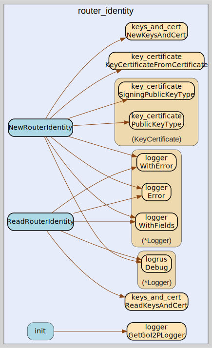

# router_identity
--
    import "github.com/go-i2p/common/router_identity"



Package router_identity implements the I2P RouterIdentity common data structure

Package router_identity implements the I2P RouterIdentity common data structure

Package router_identity implements the I2P RouterIdentity common data structure

## Usage

#### type RouterIdentity

```go
type RouterIdentity struct {
	*keys_and_cert.KeysAndCert
}
```

RouterIdentity is the represenation of an I2P RouterIdentity. 

https://geti2p.net/spec/common-structures#routeridentity

#### func  NewRouterIdentity

```go
func NewRouterIdentity(publicKey types.ReceivingPublicKey, signingPublicKey types.SigningPublicKey, cert *certificate.Certificate, padding []byte) (*RouterIdentity, error)
```
NewRouterIdentity creates a new RouterIdentity with the specified parameters.
Returns an error if key types are not permitted for Router Identities.

#### func  NewRouterIdentityFromKeysAndCert

```go
func NewRouterIdentityFromKeysAndCert(keysAndCert *keys_and_cert.KeysAndCert) (*RouterIdentity, error)
```
NewRouterIdentityFromKeysAndCert creates a new RouterIdentity from KeysAndCert.
Returns an error if the provided KeysAndCert is invalid or uses prohibited key types.

#### func  NewRouterIdentityFromBytes

```go
func NewRouterIdentityFromBytes(data []byte) (*RouterIdentity, []byte, error)
```
NewRouterIdentityFromBytes creates a RouterIdentity by parsing bytes.
Returns the parsed RouterIdentity, remaining bytes, and any errors encountered.

#### func  ReadRouterIdentity

```go
func ReadRouterIdentity(data []byte) (ri *RouterIdentity, remainder []byte, err error)
```
ReadRouterIdentity returns RouterIdentity from a []byte. The remaining bytes
after the specified length are also returned. Returns a list of errors that
occurred during parsing.

#### func (*RouterIdentity) Validate

```go
func (ri *RouterIdentity) Validate() error
```
Validate checks if the RouterIdentity is properly initialized.
Returns an error if the router identity or its components are invalid.

#### func (*RouterIdentity) IsValid

```go
func (ri *RouterIdentity) IsValid() bool
```
IsValid returns true if the RouterIdentity is properly initialized.

#### func (*RouterIdentity) AsDestination

```go
func (ri *RouterIdentity) AsDestination() destination.Destination
```
AsDestination converts the RouterIdentity to a Destination.
Returns a zero-value Destination if the receiver or its KeysAndCert is nil.

#### func (*RouterIdentity) Equal

```go
func (ri *RouterIdentity) Equal(other *RouterIdentity) bool
```
Equal returns true if two RouterIdentities are byte-for-byte identical.

#### func (*RouterIdentity) String

```go
func (ri *RouterIdentity) String() string
```
String returns a human-readable representation of the RouterIdentity.


router_identity 

github.com/go-i2p/common/router_identity

[go-i2p template file](/template.md)
