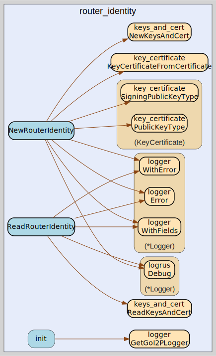

# router_identity
--
    import "github.com/go-i2p/common/router_identity"



Package router_identity implements the I2P RouterIdentity common data structure.

## Usage

#### type RouterIdentity

```go
type RouterIdentity struct {
	*keys_and_cert.KeysAndCert
}
```

RouterIdentity is the represenation of an I2P RouterIdentity. 

https://geti2p.net/spec/common-structures#routeridentity

#### func  NewRouterIdentity

```go
func NewRouterIdentity(publicKey types.ReceivingPublicKey, signingPublicKey types.SigningPublicKey, cert *certificate.Certificate, padding []byte) (*RouterIdentity, error)
```
NewRouterIdentity creates a new RouterIdentity with the specified parameters.
Returns an error if key types are not permitted for Router Identities.

#### func NewRouterIdentityWithCompressiblePadding

```go
func NewRouterIdentityWithCompressiblePadding(publicKey types.ReceivingPublicKey, signingPublicKey types.SigningPublicKey, cert *certificate.Certificate) (*RouterIdentity, error)
```
NewRouterIdentityWithCompressiblePadding creates a new RouterIdentity and
auto-generates Proposal 161-compliant compressible padding.

#### func  NewRouterIdentityFromKeysAndCert

```go
func NewRouterIdentityFromKeysAndCert(keysAndCert *keys_and_cert.KeysAndCert) (*RouterIdentity, error)
```
NewRouterIdentityFromKeysAndCert creates a new RouterIdentity from KeysAndCert.
A defensive deep copy is made. Returns an error if the provided KeysAndCert is
invalid or uses prohibited key types.

#### func  NewRouterIdentityFromBytes

```go
func NewRouterIdentityFromBytes(data []byte) (*RouterIdentity, []byte, error)
```
NewRouterIdentityFromBytes creates a RouterIdentity by parsing bytes.
Returns the parsed RouterIdentity, remaining bytes, and any errors encountered.

#### func  ReadRouterIdentity

```go
func ReadRouterIdentity(data []byte) (ri *RouterIdentity, remainder []byte, err error)
```
ReadRouterIdentity returns RouterIdentity from a []byte. The remaining bytes
after the specified length are also returned. Returns an error if parsing fails
or the data uses prohibited key types.

#### func (*RouterIdentity) Validate

```go
func (ri *RouterIdentity) Validate() error
```
Validate checks if the RouterIdentity is properly initialized and uses
permitted key types per the I2P specification. Returns an error if the
router identity or its components are invalid, or if prohibited key types
are present.

#### func (*RouterIdentity) IsValid

```go
func (ri *RouterIdentity) IsValid() bool
```
IsValid returns true if the RouterIdentity is properly initialized.

#### func (*RouterIdentity) Hash

```go
func (ri *RouterIdentity) Hash() ([32]byte, error)
```
Hash returns the SHA-256 hash of the RouterIdentity's binary representation.

#### func (*RouterIdentity) Bytes

```go
func (ri *RouterIdentity) Bytes() ([]byte, error)
```
Bytes returns the wire-format serialization of the RouterIdentity.

#### func (*RouterIdentity) AsDestination

```go
func (ri *RouterIdentity) AsDestination() destination.Destination
```
AsDestination converts the RouterIdentity to a Destination.
Returns a deep copy; mutating the returned Destination does not affect
the original RouterIdentity. Returns a zero-value Destination if the
receiver or its KeysAndCert is nil.

#### func (*RouterIdentity) Equal

```go
func (ri *RouterIdentity) Equal(other *RouterIdentity) bool
```
Equal returns true if two RouterIdentities are byte-for-byte identical.
Uses constant-time comparison to prevent timing side-channels.

#### func (*RouterIdentity) String

```go
func (ri *RouterIdentity) String() string
```
String returns a human-readable representation of the RouterIdentity.


github.com/go-i2p/common/router_identity

[go-i2p template file](/template.md)
