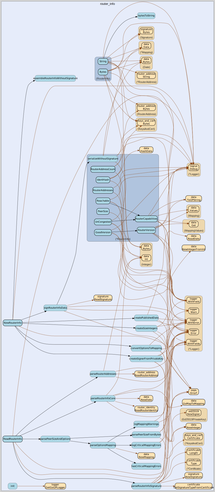

# router_info
--
    import "github.com/go-i2p/common/router_info"



Package router_info implements the I2P RouterInfo common data structure

## Usage

```go
const ED25519_PRIVATE_KEY_SIZE = 64
```
ED25519_PRIVATE_KEY_SIZE is the size in bytes of an Ed25519 private key Used for
validation when creating Ed25519 signers in router info operations

```go
const I2P_NETWORK_NAME = "i2p"
```
I2P_NETWORK_NAME is the network identifier returned by the Network() method
implementing net.Addr interface for I2P router addresses

```go
const MAX_GOOD_VERSION = 99
```
MAX_GOOD_VERSION defines the maximum acceptable router version.

```go
const MIN_GOOD_VERSION = 58
```
MIN_GOOD_VERSION defines the minimum acceptable router version.

```go
const ROUTER_INFO_MIN_SIZE = 439
```
ROUTER_INFO_MIN_SIZE defines the minimum size of a RouterInfo structure in
bytes.

#### type RouterInfo

```go
type RouterInfo struct {
}
```

RouterInfo is the represenation of an I2P RouterInfo.

https://geti2p.net/spec/common-structures#routerinfo

#### func  NewRouterInfo

```go
func NewRouterInfo(
	routerIdentity *router_identity.RouterIdentity,
	publishedTime time.Time,
	addresses []*router_address.RouterAddress,
	options map[string]string,
	signingPrivateKey types.SigningPrivateKey,
	sigType int,
) (*RouterInfo, error)
```
NewRouterInfo creates a new RouterInfo with the specified parameters.

#### func  OwnedRouterInfo

```go
func OwnedRouterInfo(keyCertificate key_certificate.KeyCertificate) *RouterInfo
```
OwnedRouterInfo creates a RouterInfo instance using the specified key
certificate.

#### func  ReadRouterInfo

```go
func ReadRouterInfo(bytes []byte) (info RouterInfo, remainder []byte, err error)
```
ReadRouterInfo returns RouterInfo from a []byte. The remaining bytes after the
specified length are also returned. Returns a list of errors that occurred
during parsing.

#### func (*RouterInfo) AddAddress

```go
func (router_info *RouterInfo) AddAddress(address *router_address.RouterAddress)
```
AddAddress adds a RouterAddress to this RouterInfo.

#### func (RouterInfo) Bytes

```go
func (router_info RouterInfo) Bytes() (bytes []byte, err error)
```
Bytes returns the RouterInfo as a []byte suitable for writing to a stream.

#### func (*RouterInfo) GoodVersion

```go
func (router_info *RouterInfo) GoodVersion() bool
```
GoodVersion checks if the RouterInfo version is acceptable.

#### func (*RouterInfo) IdentHash

```go
func (router_info *RouterInfo) IdentHash() data.Hash
```
IdentHash returns the identity hash (sha256 sum) for this RouterInfo.

#### func (RouterInfo) Network

```go
func (router_info RouterInfo) Network() string
```
Network implements net.Addr

#### func (RouterInfo) Options

```go
func (router_info RouterInfo) Options() (mapping data.Mapping)
```
Options returns the options for this RouterInfo as an I2P data.Mapping.

#### func (*RouterInfo) PeerSize

```go
func (router_info *RouterInfo) PeerSize() int
```
PeerSize returns the peer size as a Go integer.

#### func (*RouterInfo) Published

```go
func (router_info *RouterInfo) Published() *data.Date
```
Published returns the date this RouterInfo was published as an I2P Date.

#### func (*RouterInfo) Reachable

```go
func (router_info *RouterInfo) Reachable() bool
```
Reachable checks if the RouterInfo indicates the router is reachable.

#### func (*RouterInfo) RouterAddressCount

```go
func (router_info *RouterInfo) RouterAddressCount() int
```
RouterAddressCount returns the count of RouterAddress in this RouterInfo as a Go
integer.

#### func (*RouterInfo) RouterAddresses

```go
func (router_info *RouterInfo) RouterAddresses() []*router_address.RouterAddress
```
RouterAddresses returns all RouterAddresses for this RouterInfo as
[]*router_address.RouterAddress.

#### func (*RouterInfo) RouterCapabilities

```go
func (router_info *RouterInfo) RouterCapabilities() string
```
RouterCapabilities returns the capabilities string for this RouterInfo.

#### func (*RouterInfo) RouterIdentity

```go
func (router_info *RouterInfo) RouterIdentity() *router_identity.RouterIdentity
```
RouterIdentity returns the router identity as *RouterIdentity.

#### func (*RouterInfo) RouterVersion

```go
func (router_info *RouterInfo) RouterVersion() string
```
RouterVersion returns the version string for this RouterInfo.

#### func (RouterInfo) Signature

```go
func (router_info RouterInfo) Signature() (signature signature.Signature)
```
Signature returns the signature for this RouterInfo as an I2P Signature.

#### func (RouterInfo) String

```go
func (router_info RouterInfo) String() string
```
String returns a string representation of the RouterInfo.

#### func (*RouterInfo) UnCongested

```go
func (router_info *RouterInfo) UnCongested() bool
```
UnCongested checks if the RouterInfo indicates the router is not congested.


router_info 

github.com/go-i2p/common/router_info

[go-i2p template file](/template.md)
