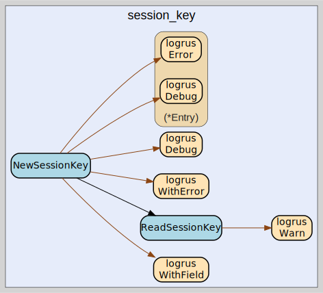

# session_key
--
    import "github.com/go-i2p/common/session_key"



Package session_key implements the I2P SessionKey common data structure.

A SessionKey is a 32-byte value used for symmetric AES-256 encryption and
decryption in the I2P network. SessionKey is defined as a bare fixed-size array
type (`[32]byte`) rather than a wrapper struct, which means values are directly
comparable with `==` and can be used as map keys. The sibling `session_tag`
package uses a wrapper struct instead; both are valid Go idioms with different
tradeoffs.

Spec: https://geti2p.net/spec/common-structures#sessionkey

## Usage

```go
const SESSION_KEY_SIZE = 32
```
SESSION_KEY_SIZE defines the size of an I2P SessionKey in bytes (32).

#### type SessionKey

```go
type SessionKey [SESSION_KEY_SIZE]byte
```

SessionKey is the representation of an I2P SessionKey.

#### func GenerateSessionKey

```go
func GenerateSessionKey() (SessionKey, error)
```
GenerateSessionKey creates a new SessionKey filled with cryptographically
secure random bytes from `crypto/rand`.

#### func NewSessionKey

```go
func NewSessionKey(data []byte) (sessionKey *SessionKey, remainder []byte, err error)
```
NewSessionKey creates a new *SessionKey from `[]byte` using ReadSessionKey.
Returns a pointer to SessionKey unlike ReadSessionKey.

#### func NewSessionKeyFromArray

```go
func NewSessionKeyFromArray(data [SESSION_KEY_SIZE]byte) SessionKey
```
NewSessionKeyFromArray creates a SessionKey from a fixed-size byte array.
This provides zero-copy construction when a `[SESSION_KEY_SIZE]byte` is already
available.

#### func ReadSessionKey

```go
func ReadSessionKey(bytes []byte) (sessionKey SessionKey, remainder []byte, err error)
```
ReadSessionKey returns SessionKey from a `[]byte`. The remaining bytes after
the 32-byte key are also returned. Returns an error if the data is too short.

#### func (SessionKey) Bytes

```go
func (sk SessionKey) Bytes() []byte
```
Bytes returns the SessionKey as a byte slice.

#### func (SessionKey) Equal

```go
func (sk SessionKey) Equal(other SessionKey) bool
```
Equal checks if two SessionKeys are equal using constant-time comparison to
prevent timing side-channel attacks.

#### func (SessionKey) IsZero

```go
func (sk SessionKey) IsZero() bool
```
IsZero returns true if the SessionKey is all zeros (uninitialized).

#### func (SessionKey) MarshalBinary

```go
func (sk SessionKey) MarshalBinary() ([]byte, error)
```
MarshalBinary implements `encoding.BinaryMarshaler`. Returns a defensive copy.

#### func (SessionKey) String

```go
func (sk SessionKey) String() string
```
String returns a hex representation of the SessionKey for debugging.

#### func (*SessionKey) SetBytes

```go
func (sk *SessionKey) SetBytes(data []byte) error
```
SetBytes sets the SessionKey value from a byte slice. The input must be exactly
SESSION_KEY_SIZE bytes long.

#### func (*SessionKey) UnmarshalBinary

```go
func (sk *SessionKey) UnmarshalBinary(data []byte) error
```
UnmarshalBinary implements `encoding.BinaryUnmarshaler`. The input must be
exactly SESSION_KEY_SIZE (32) bytes.

#### func (*SessionKey) Zeroize

```go
func (sk *SessionKey) Zeroize()
```
Zeroize overwrites the SessionKey with zeros, erasing key material from memory.
Call this when the key is no longer needed.


session_key

github.com/go-i2p/common/session_key

[go-i2p template file](/template.md)
