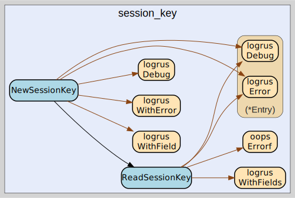

# session_key
--
    import "github.com/go-i2p/common/session_key"



Package session_key implements the I2P SessionKey common data structure

Package session_key implements the I2P SessionKey common data structure

## Usage

```go
const SESSION_KEY_SIZE = 32
```
SESSION_KEY_SIZE defines the size of an I2P SessionKey in bytes. As specified in
the I2P common structures specification.

https://geti2p.net/spec/common-structures#sessionkey

#### type SessionKey

```go
type SessionKey [SESSION_KEY_SIZE]byte
```

SessionKey is the represenation of an I2P SessionKey.

https://geti2p.net/spec/common-structures#sessionkey

#### func  NewSessionKey

```go
func NewSessionKey(data []byte) (session_key *SessionKey, remainder []byte, err error)
```
NewSessionKey creates a new *SessionKey from []byte using ReadSessionKey.
Returns a pointer to SessionKey unlike ReadSessionKey.

#### func  ReadSessionKey

```go
func ReadSessionKey(bytes []byte) (info SessionKey, remainder []byte, err error)
```
ReadSessionKey returns SessionKey from a []byte. The remaining bytes after the
specified length are also returned. Returns a list of errors that occurred
during parsing.


session_key 

github.com/go-i2p/common/session_key

[go-i2p template file](/template.md)
