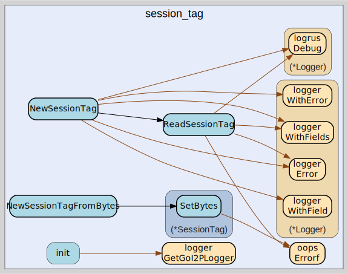

# session_tag
--
    import "github.com/go-i2p/common/session_tag"



Package session_tag implements the I2P SessionTag common data structure

Package session_tag implements the I2P SessionTag common data structure

Package session_tag implements the I2P SessionTag common data structure

## Usage

```go
const SessionTagSize = 32
```
SessionTagSize is the size of an I2P SessionTag in bytes. According to the I2P
specification, a SessionTag is always 32 bytes.

https://geti2p.net/spec/common-structures#session-tag

#### type SessionTag

```go
type SessionTag [SessionTagSize]byte
```

SessionTag is the representation of an I2P SessionTag. A SessionTag is a 32-byte
random number used in I2P for session identification.

https://geti2p.net/spec/common-structures#session-tag

#### func  NewSessionTag

```go
func NewSessionTag(data []byte) (session_tag *SessionTag, remainder []byte, err error)
```
NewSessionTag creates a new *SessionTag from []byte using ReadSessionTag.
Returns a pointer to SessionTag unlike ReadSessionTag.

#### func  ReadSessionTag

```go
func ReadSessionTag(bytes []byte) (info SessionTag, remainder []byte, err error)
```
ReadSessionTag returns SessionTag from a []byte. The remaining bytes after the
specified length are also returned. Returns a list of errors that occurred
during parsing.


session_tag 

github.com/go-i2p/common/session_tag

[go-i2p template file](/template.md)
