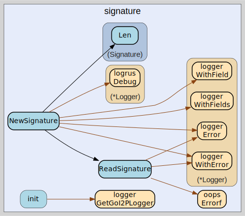

# signature
--
    import "github.com/go-i2p/common/signature"



Package signature implements the I2P Signature common data structure


Package signature implements the I2P Signature common data structure

Package signature implements the I2P Signature common data structure

Package signature implements the I2P Signature common data structure

## Usage

```go
const (
	// DSA_SHA1_SIZE defines the byte length of DSA-SHA1 signatures (40 bytes).
	// This is the legacy signature algorithm used in I2P before stronger alternatives.
	DSA_SHA1_SIZE = 40

	// ECDSA_SHA256_P256_SIZE defines the byte length of ECDSA-SHA256-P256 signatures (64 bytes).
	// Uses NIST P-256 curve with SHA-256 hash function for elliptic curve digital signatures.
	ECDSA_SHA256_P256_SIZE = 64

	// ECDSA_SHA384_P384_SIZE defines the byte length of ECDSA-SHA384-P384 signatures (96 bytes).
	// Uses NIST P-384 curve with SHA-384 hash function for higher security elliptic curve signatures.
	ECDSA_SHA384_P384_SIZE = 96

	// ECDSA_SHA512_P512_SIZE defines the byte length of ECDSA-SHA512-P521 signatures (132 bytes).
	// Uses NIST P-521 curve with SHA-512 hash function for maximum security elliptic curve signatures.
	ECDSA_SHA512_P512_SIZE = 132

	// RSA_SHA256_2048_SIZE defines the byte length of RSA-SHA256-2048 signatures (256 bytes).
	// Uses 2048-bit RSA keys with SHA-256 hash function for digital signatures.
	RSA_SHA256_2048_SIZE = 256

	// RSA_SHA384_3072_SIZE defines the byte length of RSA-SHA384-3072 signatures (384 bytes).
	// Uses 3072-bit RSA keys with SHA-384 hash function for enhanced security signatures.
	RSA_SHA384_3072_SIZE = 384

	// RSA_SHA512_4096_SIZE defines the byte length of RSA-SHA512-4096 signatures (512 bytes).
	// Uses 4096-bit RSA keys with SHA-512 hash function for maximum security RSA signatures.
	RSA_SHA512_4096_SIZE = 512

	// EdDSA_SHA512_Ed25519_SIZE defines the byte length of EdDSA-SHA512-Ed25519 signatures (64 bytes).
	// Uses Ed25519 curve with SHA-512 for high-performance Edwards-curve digital signatures.
	EdDSA_SHA512_Ed25519_SIZE = 64

	// EdDSA_SHA512_Ed25519ph_SIZE defines the byte length of EdDSA-SHA512-Ed25519ph signatures (64 bytes).
	// Uses Ed25519ph (pre-hashed) variant with SHA-512 for large message signing efficiency.
	EdDSA_SHA512_Ed25519ph_SIZE = 64

	// RedDSA_SHA512_Ed25519_SIZE defines the byte length of RedDSA-SHA512-Ed25519 signatures (64 bytes).
	// Uses RedDSA variant of Ed25519 with SHA-512 for randomized EdDSA signatures.
	RedDSA_SHA512_Ed25519_SIZE = 64
)
```
Lengths of signature keys

```go
const (
	// SIGNATURE_TYPE_DSA_SHA1 identifies DSA-SHA1 signature algorithm (type 0).
	// The original I2P signature type using 1024-bit DSA with SHA-1 hash.
	SIGNATURE_TYPE_DSA_SHA1 = 0

	// SIGNATURE_TYPE_ECDSA_SHA256_P256 identifies ECDSA-SHA256-P256 signature algorithm (type 1).
	// Uses NIST P-256 elliptic curve with SHA-256 hash function.
	SIGNATURE_TYPE_ECDSA_SHA256_P256 = 1

	// SIGNATURE_TYPE_ECDSA_SHA384_P384 identifies ECDSA-SHA384-P384 signature algorithm (type 2).
	// Uses NIST P-384 elliptic curve with SHA-384 hash function for higher security.
	SIGNATURE_TYPE_ECDSA_SHA384_P384 = 2

	// SIGNATURE_TYPE_ECDSA_SHA512_P521 identifies ECDSA-SHA512-P521 signature algorithm (type 3).
	// Uses NIST P-521 elliptic curve with SHA-512 hash function for maximum ECDSA security.
	SIGNATURE_TYPE_ECDSA_SHA512_P521 = 3

	// SIGNATURE_TYPE_RSA_SHA256_2048 identifies RSA-SHA256-2048 signature algorithm (type 4).
	// Uses 2048-bit RSA keys with SHA-256 hash function.
	SIGNATURE_TYPE_RSA_SHA256_2048 = 4

	// SIGNATURE_TYPE_RSA_SHA384_3072 identifies RSA-SHA384-3072 signature algorithm (type 5).
	// Uses 3072-bit RSA keys with SHA-384 hash function for enhanced security.
	SIGNATURE_TYPE_RSA_SHA384_3072 = 5

	// SIGNATURE_TYPE_RSA_SHA512_4096 identifies RSA-SHA512-4096 signature algorithm (type 6).
	// Uses 4096-bit RSA keys with SHA-512 hash function for maximum RSA security.
	SIGNATURE_TYPE_RSA_SHA512_4096 = 6

	// SIGNATURE_TYPE_EDDSA_SHA512_ED25519 identifies EdDSA-SHA512-Ed25519 signature algorithm (type 7).
	// Uses Ed25519 Edwards curve with SHA-512 for high-performance signatures.
	SIGNATURE_TYPE_EDDSA_SHA512_ED25519 = 7

	// SIGNATURE_TYPE_EDDSA_SHA512_ED25519PH identifies EdDSA-SHA512-Ed25519ph signature algorithm (type 8).
	// Uses Ed25519ph (pre-hashed) variant with SHA-512 for efficient large message signing.
	SIGNATURE_TYPE_EDDSA_SHA512_ED25519PH = 8

	// SIGNATURE_TYPE_REDDSA_SHA512_ED25519 identifies RedDSA-SHA512-Ed25519 signature algorithm (type 11).
	// Uses RedDSA randomized variant of Ed25519 with SHA-512 for enhanced security properties.
	SIGNATURE_TYPE_REDDSA_SHA512_ED25519 = 11
)
```
Signature type constants for I2P signature algorithms

#### type Signature

```go
type Signature struct {
}
```

Signature is the represenation of an I2P Signature.

https://geti2p.net/spec/common-structures#signature

#### func  NewSignature

```go
func NewSignature(data []byte, sigType int) (signature *Signature, remainder []byte, err error)
```
NewSignature creates a new *Signature from []byte using ReadSignature. Returns a
pointer to Signature unlike ReadSignature.

#### func  NewSignatureFromBytes

```go
func NewSignatureFromBytes(data []byte, sigType int) Signature
```
NewSignatureFromBytes creates a Signature struct from raw bytes without type
validation. This function is used when the signature type is known but
validation is not needed. It directly constructs a Signature with the provided
data and sigType without parsing or validation. Example usage: sig :=
NewSignatureFromBytes(rawData, SIGNATURE_TYPE_EDDSA_SHA512_ED25519)

#### func  ReadSignature

```go
func ReadSignature(data []byte, sigType int) (sig Signature, remainder []byte, err error)
```
ReadSignature returns a Signature from a []byte. The remaining bytes after the
specified length are also returned. Returns an error if there is insufficient
data to read the signature.

Since the signature type and length are inferred from context (the type of key
used), and are not explicitly stated, this function assumes the default
signature type (DSA_SHA1) with a length of 40 bytes.

If a different signature type is expected based on context, this function should
be modified accordingly to handle the correct signature length.

#### func (Signature) Bytes

```go
func (s Signature) Bytes() []byte
```
Bytes returns the raw signature data as a byte slice for compatibility. This
method provides access to the underlying signature bytes without exposing the
internal structure, enabling integration with external cryptographic libraries.

#### func (Signature) Len

```go
func (s Signature) Len() int
```
Len returns the length of the signature data in bytes. The length depends on the
signature algorithm type and can be used for validation or memory allocation
purposes.

#### func (Signature) String

```go
func (s Signature) String() string
```
String returns a string representation of the signature type and length.
Provides human-readable information about the signature for debugging and
logging. Format: "Signature{type: X, length: Y}" where X is the algorithm type
and Y is byte length.

#### func (Signature) Type

```go
func (s Signature) Type() int
```
Type returns the signature algorithm type identifier. The returned integer
corresponds to one of the SIGNATURE_TYPE_* constants, indicating which
cryptographic algorithm was used to generate this signature.


signature 

github.com/go-i2p/common/signature

[go-i2p template file](/template.md)
